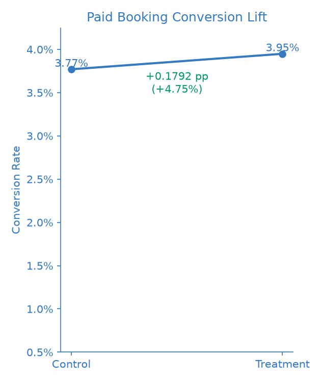
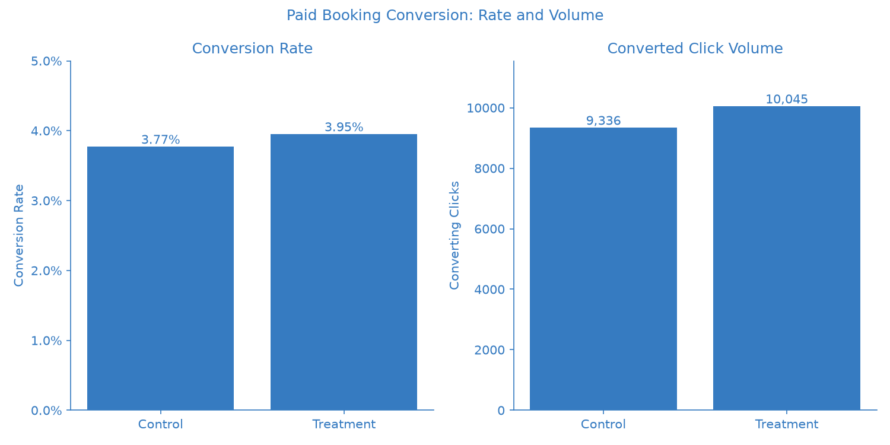
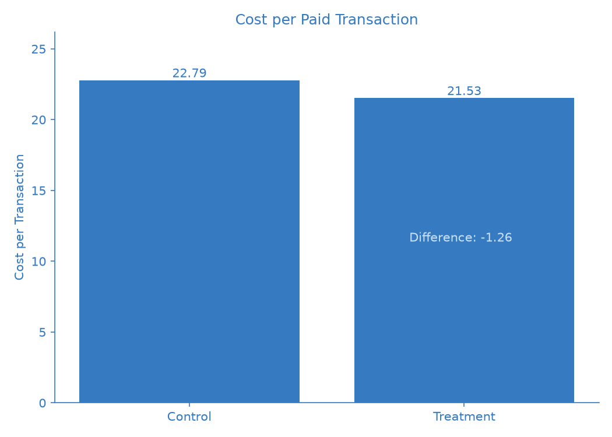

# Campaign Experiment Analysis

An A/B test evaluating whether a more focused hotel inventory strategy can improve paid booking performance for an online travel platform.

---

## Business Question

The marketing team wanted to understand:

> **Which campaign strategy is more effective at generating paid hotel bookings?**

The experiment compared two hotel inventory strategies within a Google Ads campaign experiment:

* **Control:** Top 100 hotels across the full inventory
* **Treatment:** Top 100 hotels within Jakarta, Bali, and Bandung

The test was designed to measure whether narrowing the promoted inventory could improve booking conversion while maintaining campaign efficiency and booking quality.

---

## Experiment Design

|                     | Control                       | Treatment                         |
| ------------------- | ----------------------------- | --------------------------------- |
| Hotel inventory     | Top 100 across full inventory | Top 100 in Jakarta, Bali, Bandung |
| Experiment duration | 28 days                       | 28 days                           |
| Conversion window   | 7 days                        | 7 days                            |
| Primary unit        | Campaign click                | Campaign click                    |
| Primary metric      | Paid booking conversion       | Paid booking conversion           |

The primary metric was **click-to-paid-transaction conversion rate**.

A click was considered converting when it generated at least one valid paid transaction within the predefined 7-day conversion window.

The campaign objective, targeting, bidding approach, budget framework, ad messaging, landing experience, and conversion tracking were intended to remain consistent between variants.

---

# Results

## 01 - Paid Booking Conversion

Treatment increased paid booking conversion from **3.77% to 3.95%**.



| Metric                    |                Result |
| ------------------------- | --------------------: |
| Control conversion rate   |                 3.77% |
| Treatment conversion rate |                 3.95% |
| Absolute difference       |            +0.1792 pp |
| Relative lift             |                +4.75% |
| p-value                   |              0.000982 |
| 95% CI                    | +0.0727 to +0.2858 pp |

The observed difference was statistically significant, with the 95% confidence interval remaining above zero.

---

## 02 - Conversion Rate and Volume

The higher conversion rate was accompanied by more converting clicks.



|                   | Control | Treatment |
| ----------------- | ------: | --------: |
| Eligible clicks   | 247,644 |   254,357 |
| Conversion rate   |   3.77% |     3.95% |
| Converting clicks |   9,336 |    10,045 |

Treatment generated **709 more converting clicks** in the observed experiment.

Because the variants received slightly different click volumes, the business impact was also normalized to Control traffic. At the Control traffic level, the Treatment conversion rate corresponds to approximately **444 additional converting clicks**.

---

## 03 - Campaign Efficiency

The conversion improvement also translated into lower acquisition cost per paid transaction.



| Metric                | Control | Treatment |
| --------------------- | ------: | --------: |
| Cost / transaction    |   22.79 |     21.53 |
| Booking value / click |   20.43 |     21.42 |
| Average booking value |  532.88 |    533.40 |
| Cancellation rate     |  10.30% |    10.06% |

Cost per paid transaction was **1.26 lower** for Treatment.

Booking value per click was also higher, while average booking value remained nearly unchanged. Cancellation rates were broadly similar between the two variants.

This suggests that the improvement was primarily associated with generating more converting activity rather than materially changing the value of individual bookings.

---

# Experiment Interpretation

The results show three consistent movements:

**More focused inventory**
↓
**Higher paid booking conversion**
↓
**Lower cost per paid transaction**

The increase in conversion was statistically significant, and the improvement in cost efficiency moved in the same direction.

At the same time, average booking value remained stable and cancellation rates did not show an obvious deterioration.

The experiment therefore provides evidence that the more focused inventory strategy can improve campaign efficiency under the tested conditions.

---

# Recommendation

The results support using the **Treatment inventory strategy as the preferred direction for the next campaign iteration**.

Before broader rollout, performance should continue to be monitored across:

* Paid booking conversion
* Cost per transaction
* Booking value
* Cancellation rate

The observed **4.75% relative lift** should not be assumed to remain unchanged under different traffic, inventory, or market conditions.

---

# Measurement & Validation

Campaign performance was measured against backend transaction data using a predefined 7-day conversion window.

Before running the statistical analysis, the experiment data was checked for:

* 28 days of experiment coverage
* Both experiment variants present
* Traffic allocation between variants
* Duplicate transaction records
* Valid transaction dates
* Valid conversion-window logic
* Missing click IDs
* Reconciliation between campaign conversions and backend converting clicks

The campaign platform reported:

* **9,336** paid conversions for Control
* **10,045** paid conversions for Treatment

These reconciled exactly with the converting-click counts derived from the backend transaction data.

The statistical comparison used a two-proportion test with a 95% confidence interval.

---

# Data & Analysis

The analysis combines campaign performance data with transaction-level booking data.

```text
Campaign Performance
        +
Backend Transactions
        ↓
7-Day Conversion Window
        ↓
Experiment-Level Metrics
        ↓
Statistical Test
        ↓
Business Impact
        ↓
Campaign Recommendation
```

The experiment analysis was built using:

**Python · SQL · DuckDB · Pandas · SciPy · Matplotlib**

Detailed experiment definitions and measurement decisions are documented in [`EXPERIMENT_DESIGN.md`](EXPERIMENT_DESIGN.md).

---

# Data Scope

The experiment covers a **28-day test period from August 1 to August 28, 2026**, followed by a 7-day observation period for conversions.

The data used for the analysis is generated to represent the campaign and transaction data required for the experiment measurement framework.

The analysis therefore focuses on the **experiment methodology, measurement approach, statistical evaluation, and business interpretation**, rather than representing results from a live OTA campaign.

---

# Repository Structure

```text
campaign-experiment-analysis/
│
├── README.md
├── EXPERIMENT_DESIGN.md
├── requirements.txt
├── .gitignore
├── query.py
│
├── data/
│   ├── raw/
│   │   ├── campaign_performance.csv
│   │   └── transactions.csv
│   └── processed/
│       └── experiment_analysis.csv
│
├── sql/
│   ├── validation.sql
│   └── experiment_metrics.sql
│
├── src/
│   ├── generate_data.py
│   ├── validate_experiment.py
│   ├── experiment_analysis.py
│   └── create_figures.py
│
└── outputs/
    ├── experiment_results.csv
    └── figures/
        ├── conversion_lift.png
        ├── conversion_rate.png
        └── business_impact.png
```